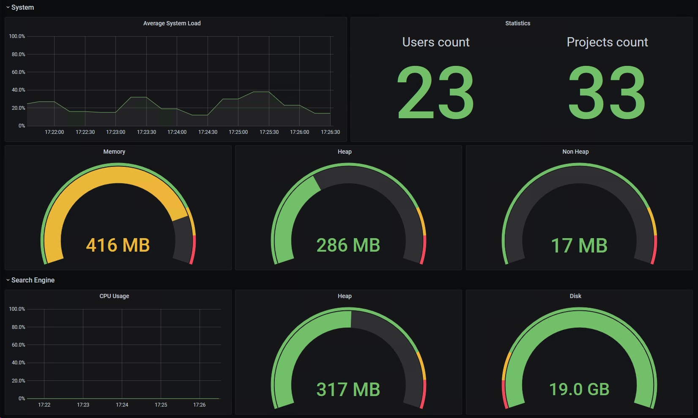

# sonarqube-prometheus-exporter
Prometheus system metrics exporter for Sonarqube.


This exporter retrieves all the available system infos from the `api/system/info` endpoint on the provided Sonarqube instance, exporting them into a Prometheus-compatible format.

> Exported metrics are extracted dynamically, this means that there are chances that some of them will be duplicated but under different names.
> Also, only numeric values (including percentages and sizes) are exported. Text-only metrics are skipped.

## Usage

> A token for a Sonarqube user with `Administer System` permissions is required.

### Local

```
python3 ./exporter.py <port> <sonar_url> <sonar_username> <sonar_password> <polling_interval>
```

### Docker

```
docker run -p 8181:8181 -e SONAR_SERVER=<sonar_url> -e SONAR_USERNAME=<sonar_username> -e SONAR_PASSWORD=<sonar_password> <polling_interval> stefanotenuta/sonarqube-prometheus-exporter
```
## Grafana

A sample dashboard is provided [here](grafana-dashboard.json).
You can also import it in your instance from [Grafana Dashboards](https://grafana.com/grafana/dashboards/14152).

### Screenshots


